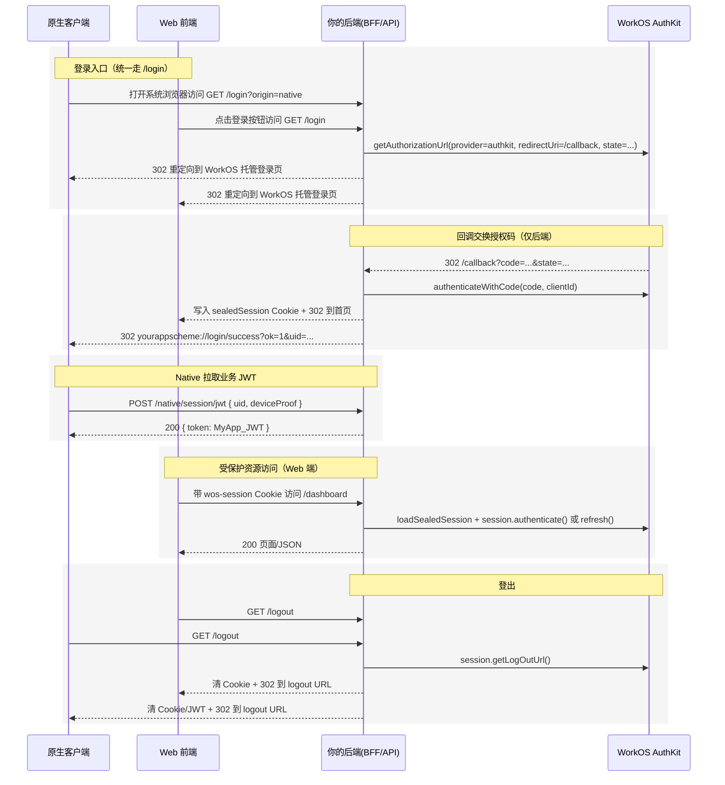

> 这是一篇可直接落地到生产的完整指南。包含跨 Web 与原生端的细粒度数据流、端到端实现代码、Native 回传登录成功的 URI Scheme 方案、后端会话与 JWT 管理、渐进式授权(Gmail/GitHub 私有仓库)的完整流程,每个设计选择的详细说明,以及所有关键环节的 WorkOS AuthKit 官方文档引用。

## 背景：身份验证的“重复造轮”困境

在当今的软件生态中，为应用提供多样化的登录选项已成为标配。用户期望能够使用他们信任的身份提供商（IdP）—— 无论是社交登录（如 Google, GitHub, Twitter）还是企业身份（如 Microsoft, 飞书）。

对于开发团队而言，逐个接入这些平台是一项高成本、低回报的重复性工作。这不仅意味着要为每一个 IdP 单独编写、调试和维护 OAuth 2.0/OIDC 的集成代码，处理它们之间微妙的 API 差异（如不同的 Scope、令牌端点和错误码），还必须自行应对更复杂的企业级需求，例如 SAML 2.0 断言和 SCIM 目录同步。

这种碎片化的集成方式带来了几个核心痛点：

1. **开发效率低下**：宝贵的时间被消耗在身份验证这种“重复造轮子”的基础设施上，而非核心业务功能。
2. **维护噩梦**：每个 IdP 的 API 都可能变更、弃用或更新安全策略，维护 5 到 10 个不同的集成点极易出错且耗时。
3. **安全风险**：在 Web 和 Native 客户端之间安全地处理和传递 `code`、`access_token` 和 `refresh_token` 极具挑战性，很容易因疏忽导致令牌泄露。

WorkOS 及其 AuthKit 旨在从根本上解决这一问题。它提供了一个统一的抽象层，将所有复杂的身份验证协议（OAuth, OIDC, SAML, Magic Link）聚合为单个、简洁的 API。开发者不再需要关心特定 IdP 的实现细节，只需与 WorkOS 对接一次，即可为应用“即插即用”地启用所有主流登录方式。

本文的目标，就是展示如何利用 WorkOS AuthKit 这一利器，构建一个低成本、高扩展性，且横跨 Web 和 Native 客户端的生产级聚合登录架构。我们将跳过所有繁琐的 IdP 单独配置，直奔主题，深入探讨最关键的架构设计与端到端实现。

## 总体架构与数据流

以下是完整的认证流程图,展示了 Web 和 Native 客户端如何通过 WorkOS AuthKit 实现统一的身份认证:



### 架构设计要点

以下是这套架构的核心设计原则及其原因:

1. **统一登录入口 `/login`**: 由后端生成 WorkOS 授权 URL,可动态附加 `state`、Scope 与来源标记,避免前端随意拼接参数,保障安全与审计一致性。  
   📖 参考:[AuthKit API Reference | Get an authorization URL](https://workos.com/docs/reference/authkit/authentication/get-authorization-url)

2. **回调 `/callback` 在后端完成**: 授权码交换与会话封存在后端完成,防止刷新令牌或会话信息暴露到前端。  
   📖 参考:[AuthKit API Reference | Authenticate with Code](https://workos.com/docs/reference/authkit/authentication/code)

3. **Web 使用 sealedSession Cookie**: 后端用 `authenticateWithSessionCookie`/`refreshAndSealSessionData` 校验与刷新,这是 WorkOS AuthKit 的原生能力。  
   📖 参考:[Sessions – AuthKit – WorkOS Docs](https://workos.com/docs/authkit/sessions)、[AuthKit API Reference | Session](https://workos.com/docs/reference/authkit/session)

4. **Native 使用 URI Scheme**: 只传递"登录成功信号",令牌通过安全 API 拉取,保证令牌仅在后端与客户端之间的 HTTPS 通道传输。  

## 环境配置与前置条件

### WorkOS 控制台配置

1. **Redirect URIs 配置**  
   添加 `https://yourapp.com/callback`(生产必须 HTTPS;Staging 才允许 `http/localhost`;生产下为支持原生客户端,允许 `http://127.0.0.1` 作为唯一例外)。  
   📖 参考:[AuthKit API Reference | Redirect URI](https://workos.com/docs/reference/authkit/authentication/get-authorization-url/redirect-uri)

2. **获取 API 密钥**  
   在 WorkOS Dashboard 获取 `WORKOS_API_KEY` 与 `WORKOS_CLIENT_ID`,并安全注入到后端环境变量。  
   
3. **配置 Logout Redirect**  
   确保登出跳转正确完成(Session helpers 中的 getLogOutUrl 对应)。  
   📖 参考:[AuthKit API Reference ｜ Logout](https://workos.com/docs/reference/authkit/logout)

4. **SSO/组织域策略**(可选)  
   如需 SSO/组织域策略,参考 Organizations/SSO 文档进行连接与域策略设置。

### Cookie 会话密钥

设置 `WORKOS_COOKIE_PASSWORD`: 至少 32 字符强密钥,用于 sealedSession 的加密封存与解封。弱密钥会导致会话校验失败。  
📖 参考:[AuthKit API Reference | Session helpers](https://workos.com/docs/reference/authkit/session-helpers)

## 端到端实现（代码 + 设计原因）

### 后端初始化

```js
// server/app.js
import express from "express";
import cookieParser from "cookie-parser";
import { WorkOS } from "@workos-inc/node";

const app = express();
app.use(express.json());
app.use(cookieParser());

const workos = new WorkOS(process.env.WORKOS_API_KEY, {
  clientId: process.env.WORKOS_CLIENT_ID,
});
```

:::tip[为什么这样初始化]
- WorkOS Node SDK 提供 `userManagement.getAuthorizationUrl`、`authenticate`、`loadSealedSession`、`refreshAndSealSessionData` 等能力,用于统一处理授权、会话与刷新。
:::

📖 参考:[API Reference – WorkOS Docs](https://workos.com/docs/reference)

### 登录入口：GET /login（动态生成授权 URL）

```js
// server/routes/auth.js
app.get("/login", (req, res) => {
  const isNative = req.query.origin === "native";
  const state = isNative ? "origin=native" : "origin=web";

  const authorizationUrl = workos.userManagement.getAuthorizationUrl({
    provider: "authkit",                      // 托管登录页
    redirectUri: "https://yourapp.com/callback",
    clientId: process.env.WORKOS_CLIENT_ID,
    state,
    // 可选:初次登录就附加额外 scope(一般不建议,推荐渐进式)
    // providerScopes: ["https://www.googleapis.com/auth/gmail.modify"],
  });

  return res.redirect(authorizationUrl);
});
```

:::tip[为什么后端生成授权 URL]
- **安全与可控**: 前端不直接拼 URL,避免误传或伪造;后端统一埋点审计与来源标记
- **参数校验**: 授权 URL 必须包含 `client_id`、`redirect_uri`、`state` 等参数,WorkOS 将对重定向地址进行校验
- **动态场景**: 通过后端可动态附加场景标记与 Scope,符合官方授权 URL 生成规范
:::

📖 参考: [AuthKit API Reference | Get Authorization URL](https://workos.com/docs/reference/authkit/authentication/get-authorization-url)

### 回调交换授权码:GET /callback

```js
app.get("/callback", async (req, res) => {
  const { code, state } = req.query;
  if (!code) return res.status(400).send("No code provided");

  try {
    const { user, accessToken, refreshToken, authenticationMethod } =
      await workos.userManagement.authenticate({
        // 等同于 authenticateWithCode;Node SDK 将路由到 /user_management/authenticate
        clientId: process.env.WORKOS_CLIENT_ID,
        grantType: "authorization_code",
        code,
        ipAddress: req.ip,
        userAgent: req.headers["user-agent"],
      });

    // 会话封存(sealedSession)供 Web 使用
    const { sealedSession } = await workos.userManagement.refreshAndSealSessionData({
      sessionData: JSON.stringify({ accessToken, refreshToken }),
      cookiePassword: process.env.WORKOS_COOKIE_PASSWORD,
    });

    res.cookie("wos-session", sealedSession, {
      path: "/",
      httpOnly: true,
      secure: true,
      sameSite: "lax",
    });

    // 统一身份联邦映射(find_or_create)
    const localUser = await db.users.findOrCreateByWorkOS({
      workosUserId: user.id,
      email: user.email,
      profile: user,
      authMethod: authenticationMethod,
    });

    // 为 Native 颁发业务 JWT(不透传在 URI;由 Native 通过 HTTPS 拉取)
    const myAppJwt = await jwt.issueForUser(localUser.id, {
      roles: localUser.roles,
      orgId: user.organization_id,
    });
    await db.tokens.bindLatestJwt(localUser.id, myAppJwt);

    // 根据 state 判断来源并处理重定向
    if (state && String(state).includes("origin=native")) {
      // Native 登录成功:通过 URI Scheme 通知,不带敏感令牌
      const nativeUri = `yourappscheme://login/success?ok=1&uid=${encodeURIComponent(localUser.id)}`;
      return res.redirect(nativeUri);
    }

    // Web 登录成功:直接回首页或目标页
    return res.redirect("/");
  } catch (err) {
    // 错误码示例:access_denied/organization_invalid/ambiguous_connection_selector 等
    console.error("AuthKit callback error:", err);
    return res.redirect("/login?error=auth_failed");
  }
});
```

:::tip[为什么在后端处理回调]
- **安全性**: 令牌与刷新逻辑只在后端处理,前端仅持有封存会话(浏览器端),Native 不经手敏感令牌
- **标准流程**: 授权码交换使用 `/user_management/authenticate` 并返回用户对象与令牌,随后通过 Session helpers 封存会话到 Cookie,这是 AuthKit 的标准流程
- **统一管理**: 立即进行用户映射与会话封存,保持认证状态一致性
:::

📖 参考:
- [AuthKit API Reference | Authenticate with code](https://workos.com/docs/reference/authkit/authentication/code)
- [AuthKit API Reference | Refresh and seal session data](https://workos.com/docs/reference/authkit/authentication/refresh-and-seal-session-data)
- [Types for errors · Issue #959 · workos/workos-node](https://github.com/workos/workos-node/issues/959)

### Web 端受保护路由:会话校验与刷新

```js
function withAuth(req, res, next) {
  const sealed = req.cookies["wos-session"];
  if (!sealed) return res.redirect("/login");

  (async () => {
    const authResp = await workos.userManagement.authenticateWithSessionCookie({
      sessionData: sealed,
      cookiePassword: process.env.WORKOS_COOKIE_PASSWORD,
    });

    if (authResp.authenticated) {
      req.authUser = authResp.user;
      return next();
    }

    // 无会话或过期:尝试刷新并回写 Cookie
    const refreshResp = await workos.userManagement.refreshAndSealSessionData({
      sessionData: sealed,
      cookiePassword: process.env.WORKOS_COOKIE_PASSWORD,
    });

    if (!refreshResp.authenticated) {
      res.clearCookie("wos-session");
      return res.redirect("/login");
    }

    res.cookie("wos-session", refreshResp.sealedSession, {
      path: "/",
      httpOnly: true,
      secure: true,
      sameSite: "lax",
    });
    return res.redirect(req.originalUrl); // 确保新会话生效
  })().catch(() => {
    res.clearCookie("wos-session");
    return res.redirect("/login");
  });
}

app.get("/dashboard", withAuth, (req, res) => {
  res.send(`Welcome ${req.authUser.email}`);
});
```

:::tip[为什么使用 sealedSession Cookie]
- **浏览器天然适配**: 浏览器端天然适配 Cookie,`httpOnly` 防 XSS
- **官方推荐**: 使用 `authenticateWithSessionCookie` 与 `refreshAndSealSessionData` 管理会话,无需自己维护 Refresh Token,这是 WorkOS 提供的"Session helpers"推荐做法
- **自动刷新**: 会话刷新统一在后端完成,前端不暴露令牌
:::

📖 参考:[AuthKit API Reference | Session helpers](https://workos.com/docs/reference/authkit/session-helpers)

### 原生端:URI Scheme 回传 + 拉取业务 JWT

```xml
<!-- AndroidManifest.xml 配置深链接 -->
<activity android:name=".LoginCallbackActivity">
    <intent-filter>
        <action android:name="android.intent.action.VIEW" />
        <category android:name="android.intent.category.DEFAULT" />
        <category android:name="android.intent.category.BROWSABLE" />
        <data
            android:scheme="yourappscheme"
            android:host="login"
            android:pathPrefix="/success" />
    </intent-filter>
</activity>
```

```kotlin
// LoginCallbackActivity.kt - 处理登录回调
class LoginCallbackActivity : AppCompatActivity() {
    override fun onCreate(savedInstanceState: Bundle?) {
        super.onCreate(savedInstanceState)
        
        // 处理深链接
        intent?.data?.let { uri ->
            if (uri.scheme == "yourappscheme" && 
                uri.host == "login" && 
                uri.path == "/success") {
                
                val ok = uri.getQueryParameter("ok") == "1"
                val uid = uri.getQueryParameter("uid")
                
                if (ok && uid != null) {
                    // 通过 HTTPS 拉取 JWT(不在 URI 中携带令牌)
                    lifecycleScope.launch {
                        try {
                            val token = NativeApi.fetchJWT(
                                uid = uid,
                                deviceProof = DeviceProof.current()
                            )
                            Session.storeJWT(token)
                            AppState.setLoggedIn(true)
                            
                            // 跳转到主界面
                            startActivity(Intent(this@LoginCallbackActivity, MainActivity::class.java))
                            finish()
                        } catch (e: Exception) {
                            Log.e("LoginCallback", "Failed to fetch JWT", e)
                            Toast.makeText(this@LoginCallbackActivity, "登录失败", Toast.LENGTH_SHORT).show()
                            finish()
                        }
                    }
                }
            }
        }
    }
}
```

```js
// 后端:Native 拉取业务 JWT
app.post("/native/session/jwt", async (req, res) => {
  const { uid, deviceProof } = req.body;
  if (!uid) return res.status(400).json({ error: "missing_uid" });

  // 校验设备证明(防止任意人持 uid 取 JWT)
  const ok = await verifyDeviceProof(uid, deviceProof);
  if (!ok) return res.status(401).json({ error: "invalid_device_proof" });

  const record = await db.tokens.getLatestJwt(uid);
  if (!record) return res.status(404).json({ error: "no_jwt" });

  return res.json({ token: record.value, tokenType: "Bearer", expiresIn: 3600 });
});
```

:::tip[为什么使用 URI Scheme + HTTPS 拉取]
- **安全性**: URI Scheme 不携令牌,仅通知成功;真正的 JWT 通过 HTTPS 拉取并校验设备证明,降低泄露风险
- **跨平台一致**: Redirect URI 在生产要求 HTTPS,Native 端允许 `http://127.0.0.1` 例外以支持本地侦听;本方案不依赖本地回环端口,使用 URI Scheme 更通用,在多平台一致性更好
- **平台支持**: iOS/Android/桌面端均原生支持 URI Scheme
:::

📖 参考:[AuthKit API Reference | Redirect URI](https://workos.com/docs/reference/authkit/authentication/get-authorization-url/redirect-uri)

### 登出：GET /logout

```js
app.get("/logout", async (req, res) => {
  try {
    const session = await workos.userManagement.loadSealedSession({
      sessionData: req.cookies["wos-session"],
      cookiePassword: process.env.WORKOS_COOKIE_PASSWORD,
    });

    const logoutUrl = await session.getLogOutUrl();
    res.clearCookie("wos-session");
    return res.redirect(logoutUrl);
  } catch {
    res.clearCookie("wos-session");
    return res.redirect("/login");
  }
});
```

:::tip[为什么使用 WorkOS 登出 URL]
- **统一管理**: 官方提供 `getLogOutUrl` 与对应的 Dashboard 配置,用于正确终止会话与跳转
- **多 IdP 一致性**: 统一通过 WorkOS 结束会话,保持多 IdP/多方式一致性
:::

📖 参考:[AuthKit API Reference | Logout](https://workos.com/docs/reference/authkit/logout)

## 渐进式授权(案例:Gmail 与 GitHub 私有仓库)

:::tip[为什么渐进式(原因)]
- **最小权限原则**: 初次登录只拿基础身份,避免一开始请求高敏感权限导致用户拒绝或平台审核不通过
- **用户体验与合规**: 用户明确点击"连接某资源"再授权,形成清晰的同意链路(WorkOS 的授权 URL 支持追加 provider_scopes 与 state)
- **安全边界**: 高敏感 Refresh Token 仅存后端,支持离线任务且不暴露给客户端
:::

📖 参考:[AuthKit API Reference | Get Authorization URL](https://workos.com/docs/reference/authkit/authentication/get-authorization-url)

### Gmail 邮箱访问(高敏感)

**所需 Scope**: `https://www.googleapis.com/auth/gmail.modify`

**流程**:
1. 用户在应用中点击"连接 Gmail"
2. 后端生成新的授权 URL,追加 Gmail Scope、`state=feature=gmail`(可在前端发起到 `/oauth/gmail/connect`)
3. WorkOS 完成授权并回调 `/callback`,后端交换并持久化 Gmail 模块的 Refresh Token(与基础登录分开存储)
4. 后端定时任务使用 Refresh Token 刷新 Access Token,并调用 Gmail API

**代码示例**:

```js
// 生成 Gmail 授权 URL
app.get("/oauth/gmail/connect", (req, res) => {
  const authorizationUrl = workos.userManagement.getAuthorizationUrl({
    provider: "authkit",
    redirectUri: "https://yourapp.com/callback",
    clientId: process.env.WORKOS_CLIENT_ID,
    state: "feature=gmail",
    providerScopes: ["https://www.googleapis.com/auth/gmail.modify"],
  });
  res.redirect(authorizationUrl);
});
```

📖 参考:[AuthKit API Reference | Get Authorization URL](https://workos.com/docs/reference/authkit/authentication/get-authorization-url)
### GitHub 私有仓库(细粒度)

**所需 Scope**: `repo`

**流程**:
1. 用户点击"连接 GitHub 私有仓库"
2. 后端生成授权 URL,请求 `repo` Scope
3. 用户拒绝时,基础登录功能不受影响(不覆盖原有低权限令牌)
4. 成功后才启用私有仓库功能;令牌按模块分区存储

📖 参考:[AuthKit API Reference | Get Authorization URL](https://workos.com/docs/reference/authkit/authentication/get-authorization-url)

## 数据模型与安全建议

- 用户表： `id`（你方）、`workos_user_id`、`email`、`profile_json`、`last_sign_in_at`、`organization_id`。
- 令牌表（模块分区）： `user_id`、`module`（gmail/github）、`refresh_token_hash`、`scope_set_hash`、`created_at`、`rotated_at`。
- 业务 JWT 表： `user_id`、`jwt_hash`、`issued_at`、`expires_at`。
- 会话（可选）： 多数场景直接用 sealedSession 无需自管；如需审计，记录 `session_id` 与快照元数据。
- 原生端安全：
  - URI Scheme 不携令牌，仅状态标记。
  - 拉取 JWT 时校验 `deviceProof`（一次性票据/设备指纹），短有效期防重放。
  - JWT 仅用于你方 API，第三方 API 访问由后端凭存储的 Refresh Token 完成。

## Web 与 Native 客户端落地细节对照

- Web：
  - 登录： 跳 `/login`，浏览器自动跟随 302。
  - 回调： 后端写 Cookie，重定向首页。
  - 受保护路由： 后端中间件用 `authenticateWithSessionCookie` 校验；必要时 `refreshAndSealSessionData` 刷新并回写 Cookie。
  - 登出： `/logout` 清 Cookie + 重定向到 WorkOS logout URL。
- Native（iOS/Android/桌面）：
  - 登录： 打开系统浏览器访问 `/login?origin=native`。
  - 回调： 后端完成交换，302 跳 `yourappscheme://login/success?ok=1&uid=...`。
  - 拉取令牌： POST `/native/session/jwt`，校验设备证明，返回 `MyApp_JWT`。
  - 后续： 持 JWT 调你方业务 API；第三方资源访问由后端凭存储的 Refresh Token 完成。

## 常见错误与排查

以下是实施过程中可能遇到的常见错误及解决方案:

### Callback 缺少 code
**现象**: 回调时 URL 中没有 `code` 参数  
**原因**: Redirect URI 配置不匹配  
**解决**: 确认 Dashboard 中 Redirect URIs 与后端 `/callback` 完整一致;WorkOS 对 Redirect URI 有严格匹配与生产环境 HTTPS 要求(127.0.0.1 例外)  
📖 参考:[AuthKit API Reference | Get Authorization URL](https://workos.com/docs/reference/authkit/authentication/get-authorization-url)

### 会话封存失败
**现象**: 无法创建或验证 sealedSession  
**原因**: `WORKOS_COOKIE_PASSWORD` 太短或不一致  
**解决**: 使用至少 32 字符的强密钥,并确保 Session helpers 封存与解封使用同一加密口令  
📖 参考:[AuthKit API Reference | Session helpers](https://workos.com/docs/reference/authkit/session-helpers)

### 频繁 302 循环
**现象**: 不断重定向到登录页  
**原因**: 刷新后未回写新的 sealedSession  
**解决**: 在 `refreshAndSealSessionData` 后重写 Cookie 并重载当前路由  
📖 参考:[AuthKit API Reference | Session helpers](https://workos.com/docs/reference/authkit/session-helpers)

### Logout 提示错误
**现象**: 登出时出现错误或无法跳转  
**原因**: 未配置 Logout Redirect  
**解决**: 在 Dashboard 补充 Logout Redirect 配置  
📖 参考:[AuthKit API Reference | Get log out URL](https://workos.com/docs/reference/authkit/session-helpers/get-logout-url)

### Native 无法捕获 URI
**现象**:原生应用无法接收登录回调  
**原因**:未正确注册 URL Types/Intent Filter/系统 URI Handler  
**解决**:检查平台注册与 `yourappscheme` 唯一性

## 参考文档

### 核心 API 文档
- **WorkOS API Reference 总览**(所有接口、错误码、会话等)  
  👉 https://workos.com/docs/reference

### 授权与认证
- **Get Authorization URL**  
  👉 https://workos.com/docs/reference/authkit/authentication/get-authorization-url
- **Authenticate with Code**  
  👉 https://workos.com/docs/reference/authkit/authentication/code
- **AuthKit 集成指南**(Node.js)  
  👉 https://workos.com/docs/authkit/vanilla/nodejs

### 会话管理
- **Sessions 文档**(Session helpers、getLogOutUrl)  
  👉 https://workos.com/docs/authkit/sessions

### 错误处理
- **错误码完整列表**  
  👉 https://workos.com/docs/reference/errors
- **错误类型与处理建议**(GitHub Issues)  
  👉 https://github.com/workos/workos-node/issues/959

## 结语

这套端到端方案将 WorkOS AuthKit 的能力以最安全与可维护的方式融入你的体系：统一后端集中式认证、Web 以 sealedSession 驱动、Native 用 URI Scheme 通知并通过 HTTPS 拉取业务 JWT、后端独占刷新令牌与离线访问、按模块管理高敏感权限。每个环节的实现与设计原因都已给出，并辅以官方文档引用，确保能无缝落地到生产环境。
