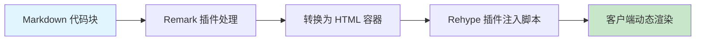
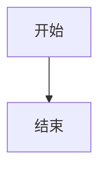
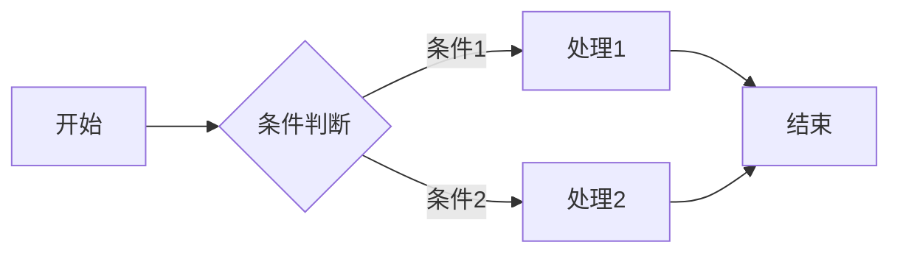
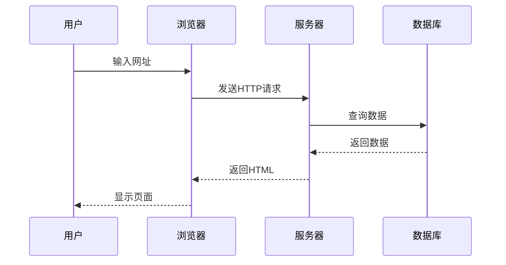
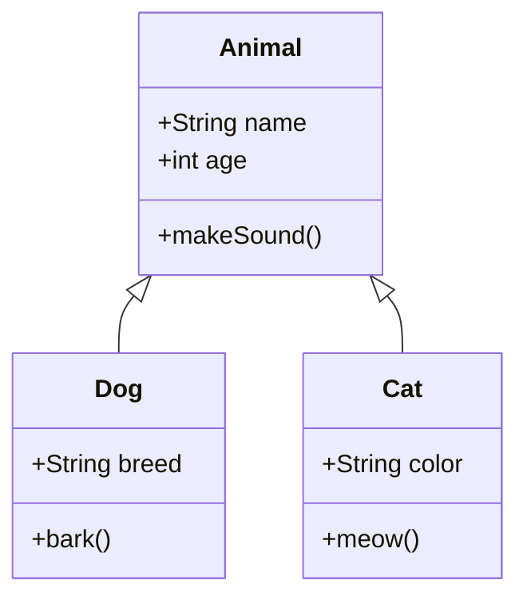
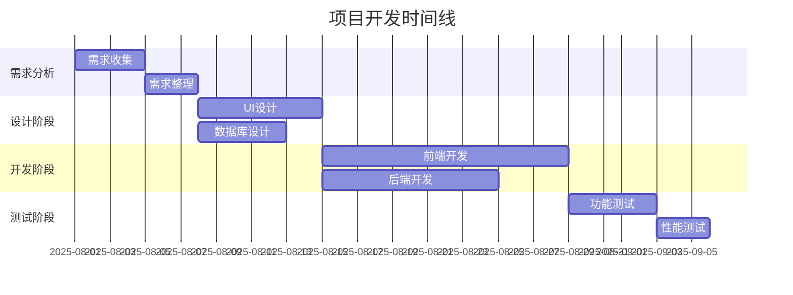
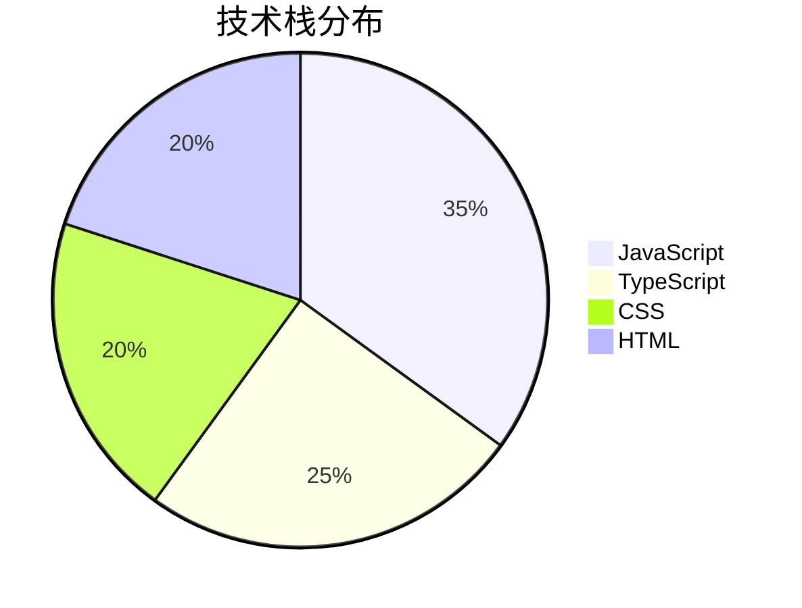

> 本文记录了在 Fuwari 主题中集成 Mermaid 图表的完整实现过程。通过 MutationObserver 监听主题切换，实现图表与深色/浅色模式的完美同步。

## 效果展示

首先看看最终的效果：



## 技术方案

### 整体架构

本方案采用客户端渲染，通过以下组件实现：

1. **Remark 插件** - 识别 Mermaid 代码块
2. **Rehype 插件** - 生成 HTML 容器和渲染脚本  
3. **渲染脚本** - 动态加载 Mermaid 库并处理主题切换
4. **样式文件** - 提供响应式布局和主题适配

### 主题切换机制

使用 `MutationObserver` 监听 `document.documentElement` 的 `class` 变化，当检测到 `dark` 类的添加或移除时，自动重新渲染图表以匹配新主题。

## 核心代码文件

所有实现代码都可以在 GitHub 仓库中找到：

### 插件文件

1. **[remark-mermaid.js](https://github.com/TatsukiMengChen/Blog/tree/feature/mermaid/src/plugins/remark-mermaid.js)** - Remark 插件，识别并转换 Mermaid 代码块
2. **[rehype-mermaid.mjs](https://github.com/TatsukiMengChen/Blog/tree/feature/mermaid/src/plugins/rehype-mermaid.mjs)** - Rehype 插件，生成 HTML 容器和注入渲染脚本
3. **[mermaid-render-script.js](https://github.com/TatsukiMengChen/Blog/tree/feature/mermaid/src/plugins/mermaid-render-script.js)** - 客户端渲染脚本，处理图表渲染和主题同步

### 配置文件

4. **[astro.config.mjs](https://github.com/TatsukiMengChen/Blog/tree/feature/mermaid/astro.config.mjs)** - Astro 配置，注册插件
5. **[markdown-extend.styl](https://github.com/TatsukiMengChen/Blog/tree/feature/mermaid/src/styles/markdown-extend.styl)** - 样式文件，包含 Mermaid 相关样式

## 快速集成步骤

### 1. 复制插件文件

将以下文件复制到你的项目中：

- [`src/plugins/remark-mermaid.js`](https://github.com/TatsukiMengChen/Blog/tree/feature/mermaid/src/plugins/remark-mermaid.js)
- [`src/plugins/rehype-mermaid.mjs`](https://github.com/TatsukiMengChen/Blog/tree/feature/mermaid/src/plugins/rehype-mermaid.mjs)  
- [`src/plugins/mermaid-render-script.js`](https://github.com/TatsukiMengChen/Blog/tree/feature/mermaid/src/plugins/mermaid-render-script.js)

### 2. 配置 Astro

在 `astro.config.mjs` 中添加插件：

```javascript
import { remarkMermaid } from "./src/plugins/remark-mermaid.js";
import { rehypeMermaid } from "./src/plugins/rehype-mermaid.mjs";

export default defineConfig({
    markdown: {
        remarkPlugins: [
            // ... 其他插件
            remarkMermaid,
        ],
        rehypePlugins: [
            // ... 其他插件  
            rehypeMermaid,
        ],
    },
});
```

### 3. 添加样式

复制 [样式文件](https://github.com/TatsukiMengChen/Blog/tree/feature/mermaid/src/styles/markdown-extend.styl) 中 Mermaid 相关的样式到你的样式文件中。

### 4. 开始使用

在 Markdown 文件中使用：

````markdown

````

## 关键实现细节

### 1. 单例模式防重复初始化

渲染脚本使用单例模式确保 Mermaid 只初始化一次：

```javascript
if (window.mermaidInitialized) {
    return;
}
window.mermaidInitialized = true;
```

### 2. 智能主题检测

通过 `MutationObserver` 监听 DOM 变化，精确检测主题切换：

```javascript
const observer = new MutationObserver((mutations) => {
    mutations.forEach((mutation) => {
        if (mutation.type === "attributes" && mutation.attributeName === "class") {
            const wasDark = mutation.oldValue?.includes("dark") || false;
            const isDark = mutation.target.classList.contains("dark");
            
            if (wasDark !== isDark) {
                renderMermaidDiagrams(); // 重新渲染图表
            }
        }
    });
});
```

### 3. 批量渲染优化

使用 `Promise.all` 并行渲染多个图表，提升性能：

```javascript
const renderPromises = Array.from(mermaidElements).map(async (element) => {
    // 渲染单个图表
});
await Promise.all(renderPromises);
```

### 4. 防并发渲染

通过标志位防止并发渲染造成的问题：

```javascript
let isRendering = false;

function renderMermaidDiagrams() {
    if (isRendering) return;
    isRendering = true;
    // 渲染逻辑...
    isRendering = false;
}
```

## 图表示例

### 流程图



### 序列图



### 类图



### 甘特图



### 饼图



## 参考资料

- [Mermaid 官方文档](https://mermaid.js.org/) - 图表语法和配置
- [Astro 官方文档](https://docs.astro.build/) - 插件开发指南
- [Fuwari 主题](https://github.com/saicaca/fuwari) - 主题源码和文档
- [完整实现代码](https://github.com/TatsukiMengChen/Blog/tree/feature/mermaid/src/plugins) - 本文所有插件代码
